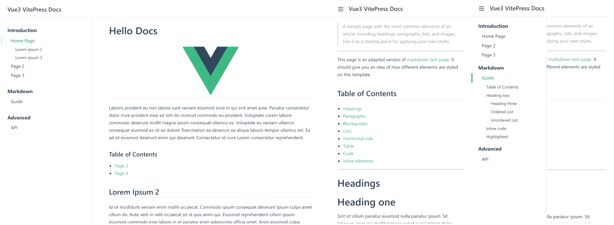

# Vue3 VitePress Docs

> Sample Documentation Website built with VitePress

<h2 align="center">
  
  <br>
</h2>


## Quick Start

```bash
# Install dependencies
npm install

# Run in development mode
npm run docs:dev

# Run in production mode
npm run docs:build
npm run docs:serve
```
